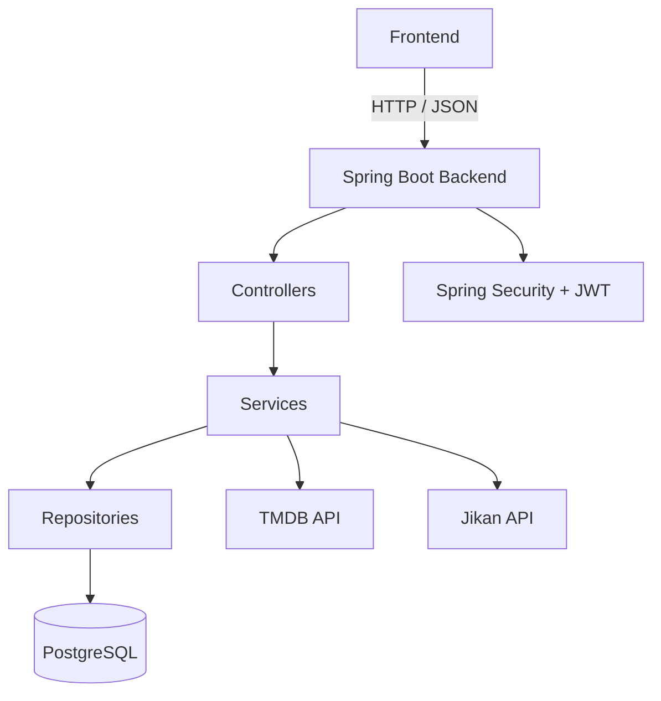
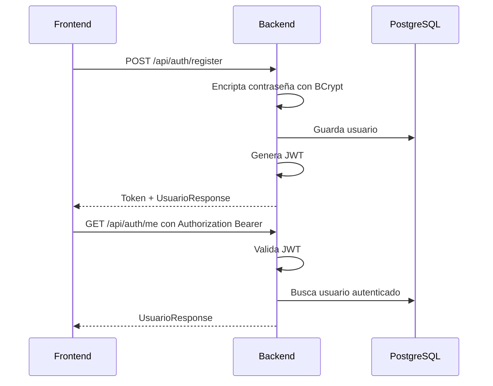
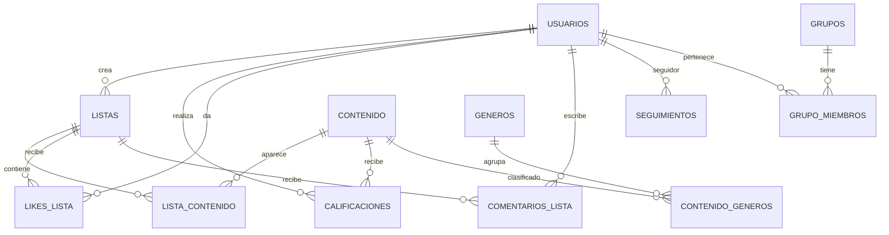
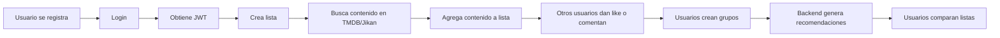

# Backend Homiwood

Backend de Homiwood, una red social para crear, compartir y comparar listas de películas, series y anime.

## Tecnologías

- Java 21
- Spring Boot
- Spring Data JPA
- PostgreSQL
- Spring Security
- JWT
- BCrypt
- Jakarta Validation
- TMDB API
- Jikan API

---

## Arquitectura general



---

## Capas del backend

```text
controller/   Recibe peticiones HTTP
service/      Contiene lógica de negocio
repository/   Acceso a base de datos
model/        Entidades JPA
dto/          Requests y responses
exception/    Manejo global de errores
mapper/       Conversión de entidades a DTOs
security/     Filtros JWT
config/       CORS y seguridad
```

---

## Módulos implementados

| Módulo | Estado | Descripción |
|---|---:|---|
| Usuarios | Hecho | Registro, listado, búsqueda y eliminación |
| Autenticación | Hecho | Login, registro, JWT y BCrypt |
| Listas | Hecho | Creación y consulta de listas |
| Contenido | Hecho | Películas, series y anime |
| Géneros | Hecho | Administración de géneros |
| Contenido por lista | Hecho | Agregar contenido a listas |
| Calificaciones | Hecho | Puntajes y comentarios sobre contenido |
| Likes | Hecho | Likes a listas |
| Seguimientos | Hecho | Seguir y dejar de seguir usuarios |
| Grupos | Hecho | Crear grupos y agregar miembros |
| Comentarios | Hecho | Comentarios en listas |
| Recomendaciones | Hecho | Recomendaciones por usuario y grupo |
| Comparaciones | Hecho | Comparar usuarios y grupos |
| TMDB API | Hecho | Buscar películas y series |
| Jikan API | Hecho | Buscar anime |

---

## Flujo de autenticación



---

## Seguridad

El backend usa JWT para proteger rutas privadas.

### Rutas públicas

```http
POST /api/auth/register
POST /api/auth/login
GET  /api/health
GET  /api/catalogo/tmdb
GET  /api/catalogo/anime
GET  /api/catalogo/buscar
```

### Rutas protegidas

Todas las demás rutas requieren:

```http
Authorization: Bearer TOKEN
```

---

## Endpoints autenticados `/api/me`

Estos endpoints usan el usuario desde el JWT, por lo tanto el frontend no necesita mandar `idUsuario`.

```http
GET  /api/auth/me

GET  /api/me/listas
POST /api/me/listas

POST /api/me/listas/{idLista}/comentarios
GET  /api/me/comentarios

POST   /api/me/listas/{idLista}/likes
DELETE /api/me/listas/{idLista}/likes
GET    /api/me/likes

POST   /api/me/siguiendo/{idSeguido}
DELETE /api/me/siguiendo/{idSeguido}
GET    /api/me/siguiendo
GET    /api/me/seguidores

POST /api/me/grupos
GET  /api/me/grupos
```

---

## Modelo general de datos



---

## Flujo principal del MVP



---

## Validaciones

Se usan validaciones con Jakarta Validation:

- `@NotBlank`
- `@NotNull`
- `@Email`
- `@Size`
- `@Pattern`
- `@Min`
- `@Max`
- `@Positive`
- `@PositiveOrZero`

Los errores se devuelven desde `GlobalExceptionHandler`.

Ejemplo de error:

```json
{
  "status": 400,
  "error": "Bad Request",
  "message": "Error de validación en los datos enviados.",
  "validationErrors": {
    "username": "El username debe tener entre 3 y 50 caracteres",
    "email": "El email debe tener un formato válido"
  }
}
```

---

## Respuestas limpias con DTOs

El backend no debe devolver entidades completas directamente.

Se usan DTOs como:

```text
UsuarioResponse
ListaResponse
ContenidoResponse
ComentarioListaResponse
GrupoResponse
LikeListaResponse
SeguimientoResponse
```

Esto evita exponer datos sensibles como:

```text
passwordHash
```

---

## Variables de entorno necesarias

En local se deben configurar:

```text
DB_PASSWORD
TMDB_TOKEN
JWT_SECRET
```

Ejemplo en IntelliJ:

```text
TMDB_TOKEN=token_real;DB_PASSWORD=password_postgres;JWT_SECRET=clave_larga_segura
```

---

## Pendiente importante

### Permisos de dueño

Aunque las rutas están protegidas con JWT, falta reforzar permisos específicos.

Ejemplos:

- Solo el dueño de una lista debería poder eliminarla.
- Solo el autor de un comentario debería poder editarlo o borrarlo.
- Solo el admin de un grupo debería poder eliminar miembros.
- Solo el dueño de una lista debería poder agregar o eliminar contenido de esa lista.

### Endpoints `/api/me` faltantes

Falta mejorar:

```http
PUT    /api/me/listas/{idLista}
DELETE /api/me/listas/{idLista}
POST   /api/me/listas/{idLista}/contenidos/externo
DELETE /api/me/listas/{idLista}/contenidos/{idListaContenido}
PUT    /api/me/comentarios/{idComentario}
DELETE /api/me/comentarios/{idComentario}
```

### Documentación de endpoints

Falta completar:

```text
docs/endpoints.md
```

con ejemplos de request y response.

